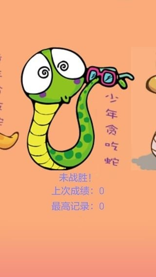

EncircleSnake（围住贪吃蛇）
===============

### 写在最前面
#### 2015年4月心血来潮写的，还是基于Eclipse ADT的开发环境。有发布到应用市场，虽然没人玩。

### 介绍
#### 玩家控制一条蛇，去吃豆豆来变长，去围住电脑的蛇就赢了。
#### 后来上传了应用市场，就没管了，现在好像只有一家市场可以搜索到，还是它的爬虫自己爬的。
#### 差不多长这样 

[找来的APK地址 应该还可以运行吧](./apk/snake.apk)

### 后记
#### 发现后来4399搞了个网络游戏，简直就是这个游戏的网络版。当然啦，游戏粘性还是很差。

### 今天
#### 因为要整理下电脑，为未来空出磁盘空间，遂上传。然后删除本地文件。

